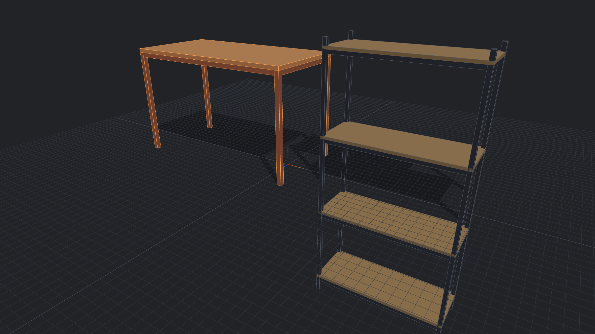
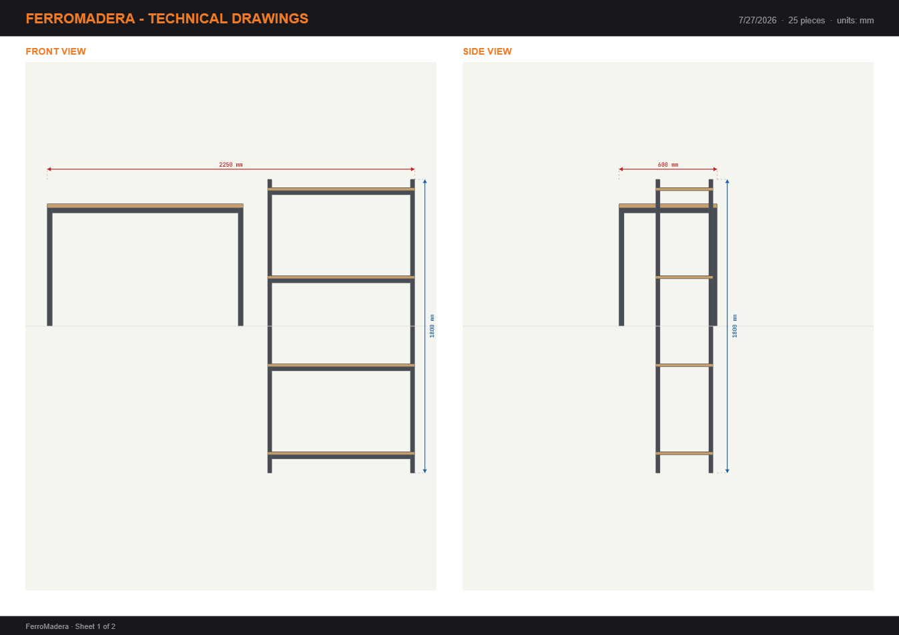
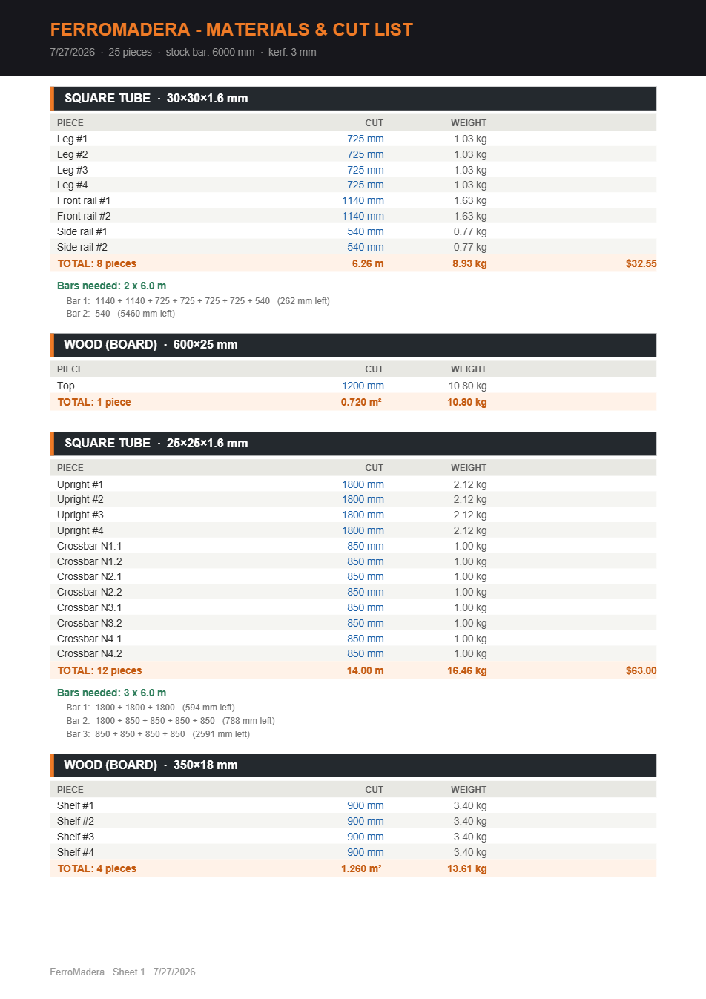
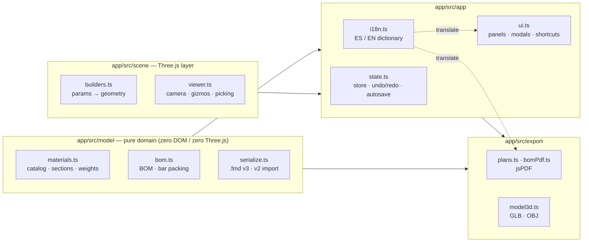

<div align="center">


# FerroMadera

**A 3D furniture designer built for the workshop — not just the screen.**

Design steel & wood furniture in the browser, then walk to the bench with
optimized cut lists, weight & cost estimates, and dimensioned technical drawings.

[](https://www.typescriptlang.org/)
[](https://threejs.org/)
[](https://vitejs.dev/)
[](#-testing)
[](#-single-file-distribution)
[](#-internationalization)



</div>

---

## Why

Most 3D tools stop at the pretty picture. Welders and makers need what comes **after** the design:

- *How many 6-meter stock bars do I buy, and how do I cut them?*
- *How much will this weigh? What will the material cost?*
- *What are the exact fabrication dimensions of every piece?*

FerroMadera treats those questions as first-class features. The 3D viewport is the
means; the **cut list, the bill of materials and the technical drawings are the product**.

## ✨ Features

### Design
- **Profile catalog** — square / rectangular / round structural tube, angle iron,
  flat bar and wood boards, each defined by its real commercial parameters
  (profile, wall thickness, length).
- **Pro-grade 3D editing** — translate/rotate gizmos with grid & 15° snapping,
  multi-select, groups, mirror copies, linear arrays, point-to-point measuring,
  per-piece visibility and live dimension labels.
- **Parametric templates** — generate a complete table or shelving unit from a
  handful of measurements, then tweak any piece freely.
- **Fully custom by design** — nothing is locked to a template: every piece can be
  moved, rotated, resized, recolored and renamed at will.

### Fabricate
- **Cut-list optimization** — first-fit-decreasing bin packing distributes every
  cut across commercial stock bars (configurable length and kerf), reporting bars
  needed, per-bar layout, leftovers and utilization %.
- **Weight & cost** — real cross-section math (tube walls included) gives kg per
  piece and per profile; optional prices per meter / m² produce a cost estimate.
- **Technical drawings** — 2-page PDF with three dimensioned orthographic views
  plus a bill of materials, generated entirely client-side.

### Share
- **`.glb` export** at real-world scale (meters) — drops straight into Blender
  with piece names and colors intact. `.obj` export (mm) for CAD workflows.
- **PNG views** with overall dimensions and a fabrication table.
- **Project files** (`.fmd`, plain JSON) plus silent autosave in the browser.

<div align="center">
<table>
  <tr>
    <td align="center"><br><sub>Technical drawings — dimensioned orthographic views</sub></td>
    <td align="center"><br><sub>Bill of materials — cuts, bars, weight & cost</sub></td>
  </tr>
</table>
</div>

## 📁 Repository

| Folder | What it is | Published |
|---|---|---|
| [`app/`](app) | The application. TypeScript + Three.js + Vite, builds to a single self-contained HTML file. | yes → `/app` |
| [`landing/`](landing) | Marketing site. Plain HTML + CSS + ES modules, no build step. | yes → site root |
| `scripts/` | Assembles the publishable `dist/` folder. | no |

## 🚀 Quick start

**Just use it** — grab the built `app/dist/index.html`. It is the entire
application in a single file: double-click it, or host it anywhere static.
No install, no account, no backend.

**Develop:**

```bash
npm run preview         # build + serve the WHOLE site → localhost:4000
npm run dev             # app dev server               → localhost:5173
npm run serve:landing   # landing only, fast iteration → localhost:4173
npm test                # unit tests (Vitest)
npm run build           # build app + assemble dist/ (used by Vercel)
```

`npm run preview` is the one that mirrors production: landing at `/`, app at
`/app`, so the landing's **Start** button actually opens the app. The other
servers each show one half of the site in isolation.

The landing needs no compilation — it is static files the browser reads as-is.
The app does, because it is TypeScript split across modules.

## 🌍 Deploy

`npm run build` produces `dist/` with the landing at the root and the app under
`/app`, ready for any static host. [`vercel.json`](vercel.json) already carries
the configuration, so importing the repository needs no further setup:

| Setting | Value |
|---|---|
| Framework Preset | Other |
| Build Command | `npm run build` |
| Output Directory | `dist` |

Result: `yourdomain.com` serves the landing, `yourdomain.com/app` opens the app.

## 🧱 Architecture

The core principle: **fabrication parameters are the single source of truth**.
Geometry is always *rebuilt* from `params` — meshes are never scaled — so undo,
autosave, BOM math and every export stay consistent by construction.



| Layer | Responsibility | Dependencies |
|---|---|---|
| `app/src/model/` | Domain types, section math, weights, BOM, bar packing, serialization | **none** — runs in Node, fully unit-tested |
| `app/src/scene/` | Geometry builders, renderer, controls, gizmo, raycasting | Three.js |
| `app/src/app/` | Central store (undo/redo/autosave), UI wiring, i18n, overlay | model + scene |
| `app/src/export/` | PDF drawings, materials PDF, GLB/OBJ | model + jsPDF + Three.js |

### Key technical decisions

| Decision | Rationale |
|---|---|
| **Single-file build** (`vite-plugin-singlefile`) | The whole app ships as one `index.html` — double-click distribution, trivial hosting, easy to share with non-technical users |
| **Params-driven geometry, never mesh scaling** | Non-uniform scale corrupts profiles on rotated pieces; rebuilding from params keeps every consumer (BOM, exports, labels) exact |
| **jsPDF** for documents | Replaced a hand-rolled PDF writer that produced files some viewers rejected; battle-tested output |
| **GLB in meters** | glTF's canonical unit — Blender imports 1:1 with names, colors and transparency preserved |
| **Hand-rolled i18n** (~180 keys) | Two languages don't justify an i18n framework; the model stores language-neutral keys, presentation translates |
| **No framework** | Direct DOM with event delegation keeps the bundle lean and the UI honest — state lives in one store, rendering is explicit |

## 🧪 Testing

**28 Vitest unit tests** cover the parts where a silent mistake would be
expensive: hand-verified weights per profile, bin-packing edge cases (kerf,
exact fits, impossible cuts), v2→v3 file migration, serialization round-trips,
i18n completeness (every key must exist in both languages with matching
`{variables}`), and material state — a regression suite added after a bug where
pieces stayed opaque in the viewport while exporting correctly.

```bash
npm test
```

## 📦 Single-file distribution

Building emits **one `app/dist/index.html` (~1.4 MB)** with all code, styles and
icons inlined. It runs from `file://`, a USB stick, or any static host. The dev
entry (`app/index.html`) detects double-click misuse and points users to the
built file.

## 🌐 Internationalization

Spanish and English, switchable live from the flag selector — no reload, design
untouched. The choice persists; first visit follows the browser language.
**Exports speak the active language too** (drawings, BOM PDF, new piece names).
Adding a language = one more column in
[`app/src/app/i18n.ts`](app/src/app/i18n.ts). The landing has its own dictionary
in [`landing/js/i18n.js`](landing/js/i18n.js).

## 📄 Project file format

<details>
<summary><code>.fmd</code> — plain JSON, version 3</summary>

```jsonc
{
  "version": 3,
  "app": "ferromadera",
  "idCounter": 12,
  "groupCounter": 1,
  "groups": [
    { "id": 1, "name": "Table", "pos": {"x":0,"y":375,"z":0}, "rot": {"x":0,"y":0,"z":0} }
  ],
  "pieces": [
    {
      "id": 2,
      "type": "tube_square",              // catalog key
      "params": { "L": 725, "a": 30, "e": 1.6 },  // fabrication truth (mm)
      "color": "#5a5f6b",
      "opacity": 1,
      "visible": true,
      "name": "Leg #1",
      "groupId": 1,
      "pos": { "x": -585, "y": -12.5, "z": -285 },  // local to group
      "rot": { "x": 0, "y": 0, "z": 1.5708 }
    }
  ]
}
```

Files from the original FerroMadera prototype (v2 format) are detected and
migrated automatically — mesh scale factors are baked into real parameters.

</details>

## ⌨️ Shortcuts

<details>
<summary>Full keyboard map</summary>

| Key | Action |
|---|---|
| `G` / `R` / `Esc` | Move gizmo / rotate gizmo / select mode · deselect |
| `F` / `Home` | Frame selection / isometric view |
| `M` | Measure between two points |
| `Ctrl+D` | Duplicate selection |
| `Del` | Delete selection |
| `Ctrl+Z` / `Ctrl+Y` | Undo / redo |
| `Ctrl+S` | Save project |
| `← → ↑ ↓` | Nudge on the ground plane (snap step) |
| `PgUp` / `PgDn` | Raise / lower |
| `Shift+click` | Multi-select |
| `Alt+click` | Select a piece inside a group |

</details>

## 🗺️ Roadmap

- [ ] **Parametric joints** — "this bar spans between these two legs": lengths
      derived from anchors, updating when pieces move
- [ ] Portuguese localization
- [ ] DXF export for CNC plasma/laser tables
- [ ] Assembly step-by-step view for weld sequencing

## 📄 License

© 2026 Emilio Orellana. All rights reserved.

The source is published for portfolio evaluation. Commercial use, redistribution
or resale require written permission from the author.

---

<div align="center">
<sub>Built with TypeScript, Three.js and a healthy respect for kerf.</sub>
</div>
